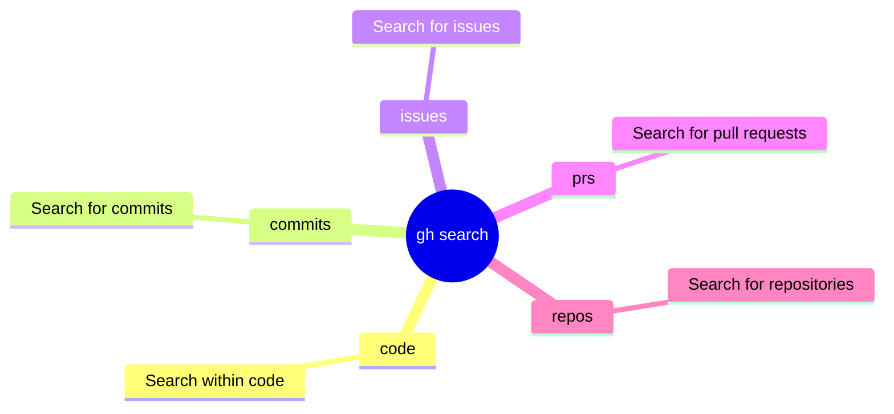

# gh-search Skill

<!-- markdownlint-disable MD013 MD023 MD031 MD032 -->

## When to Use
- You need to find repositories by topic, description, or keywords across all of GitHub.
- You need to search for code snippets containing a specific function name, pattern, or string across public repositories.
- You need to locate issues or pull requests by state, label, author, or other qualifiers across repos.
- You need to find commits by message content, author, or date range.
- You need to discover relevant tools, libraries, or curated resources using structured queries with `--json` output.
- You need to quickly verify whether a concept, pattern, or dependency exists in the broader GitHub ecosystem.

## When Not to Use
- You are searching within a single repository you already know — use `gh issue list`, `gh pr list`, `gh run list`, or `git log` with `--repo` for more targeted results.
- You need to search for files by name or path within a repo — use the **Glob** tool instead for local workspace or `gh api` with code search endpoints.
- You need real-time or precise commit-search results — code search has indexing delays; very recent changes may not appear immediately.
- You need to perform administrative searches (e.g., finding all repos in an org with specific settings) — use **gh-api** with GraphQL for org-level queries.

## Common Pitfalls
- Code search has **indexing delays**; changes pushed within the last few minutes may not appear in search results — wait before assuming a push failed.
- The default `--limit` is 30, which can return too many or too few results depending on your query — always set an explicit limit appropriate to your use case.
- Parsing default tabular output of `gh search` with tools like `grep` or `awk` is fragile — always use `--json` for structured JSON output that is safe to parse programmatically.
- Search queries are subject to GitHub's code search limitations: special characters, very long queries, or certain operators may behave differently than expected — simplify queries and test incrementally.

Use `gh search` to query GitHub for code, commits, issues, pull requests, and repositories.
Prefer structured JSON output over manual text parsing.

## Commands / Usage Patterns

- **Search Repositories**:
  `gh search repos "query" --limit 5 --json nameWithOwner,description,url`
  Example output:
  `[{"description":"RAG Framework...","nameWithOwner":"truefoundry/cognita","url":"..."}]`

- **Search Pull Requests**:
  `gh search prs --state=open --limit 5 --json number,title,repository`
  Example output:
  `[{"number":123,"repository":{"name":"repo"},"title":"Fix issue"}]`

- **Search Issues**:
  `gh search issues --state=open --label="bug" --limit 5 --json number,title,url`
  Example output:
  `[{"number":456,"title":"Bug description","url":"..."}]`

- **Search Code**:
  `gh search code "functionName" --extension="js" --json path,url`
  Example output:
  `[{"path":"src/index.js","url":"https://github.com/.../src/index.js"}]`

- **Search Commits**:
  `gh search commits "fix regex" --limit 5 --json sha,message,author`
  Example output:
  `[{"author":{"login":"user"},"message":"fix regex","sha":"abcdef"}]`

## Mindmap of Commands

## Core Principles

- Use `--json` to request specific fields and output in structured JSON format. This avoids fragile parsing of tabular shell output.
- Always use `--limit` to bound the results, especially when searching across all of GitHub. Default limit is often 30, but explicit bounds ensure efficiency.
- When searching within a specific repository, use the `--repo="owner/repo"` flag to narrow the search scope.
- For complex data extraction, combine `--json` with `--jq` to filter results on the client side.

## Diagnostics and Troubleshooting

- If a search returns no results, try broadening the query or removing filters like `--extension` or `--label` to isolate the problem.
- Remember that code search has indexing delays; very recent changes might not appear immediately.

## What to Avoid

- Do not use `grep` or `awk` to parse the default tabular output of `gh search`. Always use `--json`.
- Avoid unbounded searches (without `--limit`) if you only need a few examples or the latest item.
