<!-- markdownlint-disable MD003 MD022 MD026 MD041 -->
---
name: mermaid
description: >-
  Guide for creating and maintaining Mermaid.js diagrams for documentation, architecture, and flow visualization.

  Maintained at: <https://github.com/Cogni-AI-OU/cogni-ai-agent-skills>

---
# Mermaid Skill

Expert in creating, optimizing, and troubleshooting Mermaid.js diagrams.
Prioritize clarity, readability, and adherence to Mermaid syntax standards for
various diagram types (flowcharts, sequence diagrams, Gantt charts, etc.).

## When to Activate

- User wants to visualize a process, architecture, or sequence of events using diagrams.
- User needs to update existing Mermaid diagrams in Markdown files.
- Agent needs to explain complex logic or flows using a visual representation.
- Troubleshooting syntax errors in existing Mermaid code blocks.

## Core Principles

- **Clarity First**: Diagrams should be easy to follow and not overly cluttered.
- **Consistent Styling**: Use consistent naming conventions and styling for nodes and edges.
- **Standard Syntax**: Adhere strictly to Mermaid.js syntax to ensure compatibility across viewers (GitHub, VS Code, etc.).
- **Minimalism**: Only include essential information in diagrams to maintain focus.

## Diagram Types & Patterns

### Architecture Diagrams

- Use `architecture-beta` to show system structure and relationships.

Example:

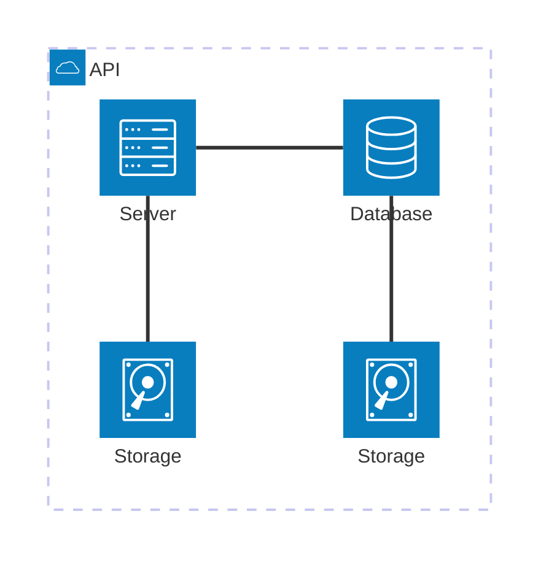

### Block Diagrams

- Use `block-beta` to show ...

Example:

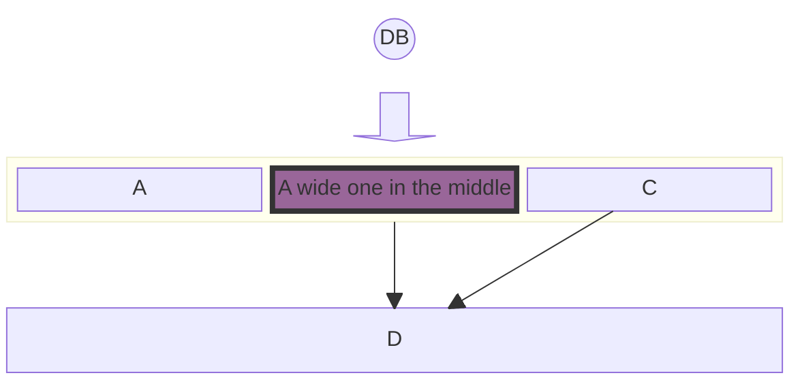

### Class Diagrams

> In software engineering, a class diagram in the Unified Modeling Language (UML) is a type of static structure diagram
> that describes the structure of a system by showing the system's classes, their attributes, operations (or methods), and the relationships among objects.

- Use `classDiagram` to show ...

Example:

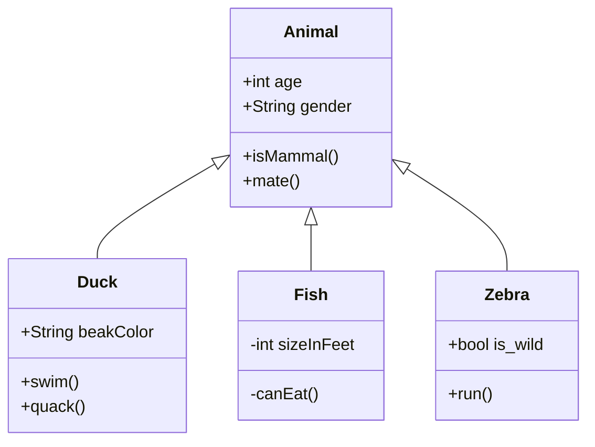

Docs: <https://mermaid.js.org/syntax/classDiagram.html>

### Flowcharts

- Use `flowchart to show ...

Example:

  ```mermaid
flowchart TD
    Start([Start]) --> GetMoney[Get money]
    GetMoney --> GoShopping[Go shopping]
    GoShopping --> Laptop{Is it a Laptop?}
    Laptop -->|Yes| BuyLaptop[Buy Laptop]
    Laptop -->|No| BuyiPhone[Buy iPhone]
    BuyLaptop --> Stop([End])
    BuyiPhone --> Stop
  ```

Example Flowchart with New Shapes:

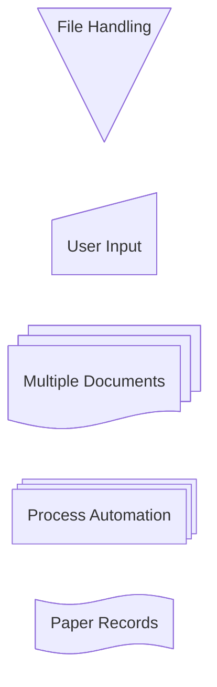

Docs: <https://mermaid.js.org/syntax/flowchart.html>

### Entity Relationship Diagrams

> An entity–relationship model (or ER model) describes interrelated things of interest in a specific domain of knowledge.
> A basic ER model is composed of entity types (which classify the things of interest) and specifies relationships that
> can exist between entities (instances of those entity types)

- Use `erDiagram` to show ...

Example:

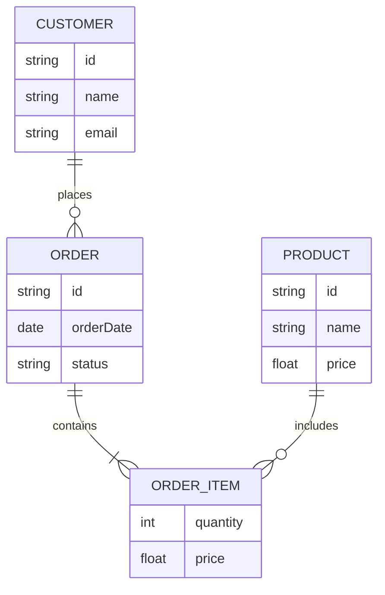

Docs: <https://mermaid.js.org/syntax/entityRelationshipDiagram.html>

### Gantt Charts

> A Gantt chart is a type of bar chart, first developed by Karol Adamiecki in 1896, and independently by Henry Gantt in the 1910s,
> that illustrates a project schedule and the amount of time it would take for any one project to finish.
> Gantt charts illustrate number of days between the start and finish dates of the terminal elements and summary elements of a project.

- Use `gantt` for project schedules and timelines.
- Define `dateFormat`, `title`, and `section` for organization.

Example:

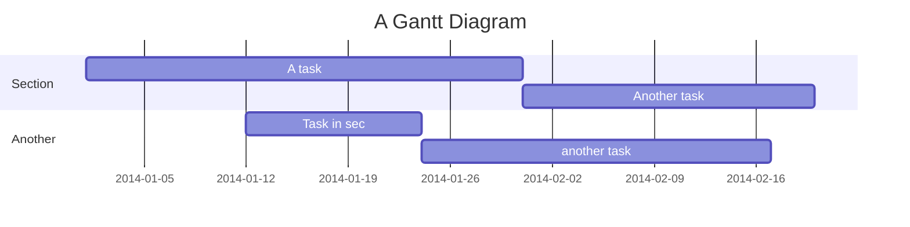

Syntax:

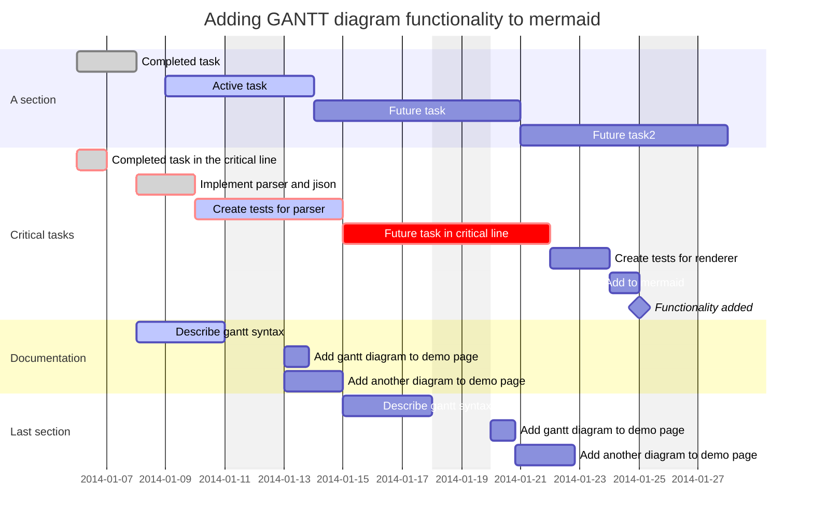

Docs: <https://mermaid.js.org/syntax/gantt.html>

### Mindmap Diagrams

- Use `mindmap` for hierarchical information and brainstorming.

Example:

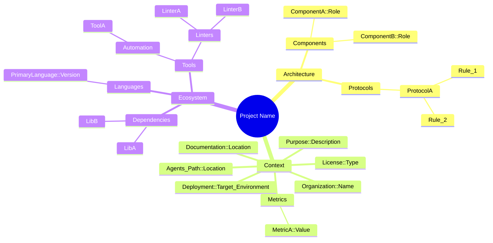

### Sequence Diagrams

- Use `sequenceDiagram` for interacting components.
- Utilize `participant` and `actor` for clarity.
- Use `autonumber` for step-by-step flows.

Examples:

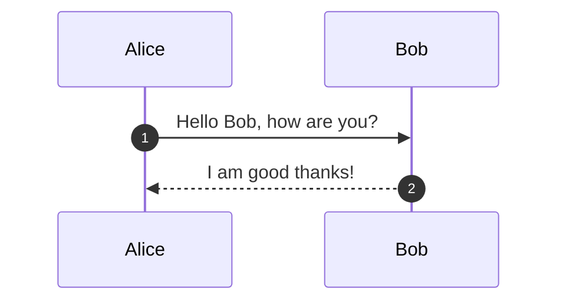

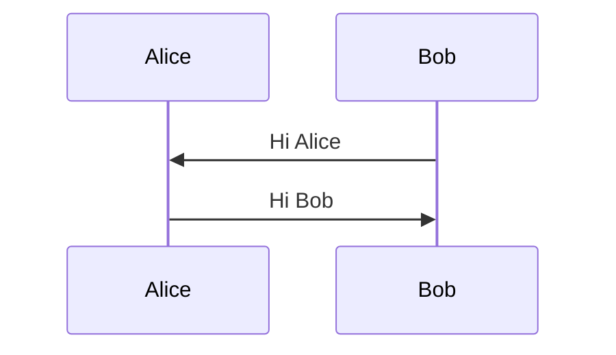

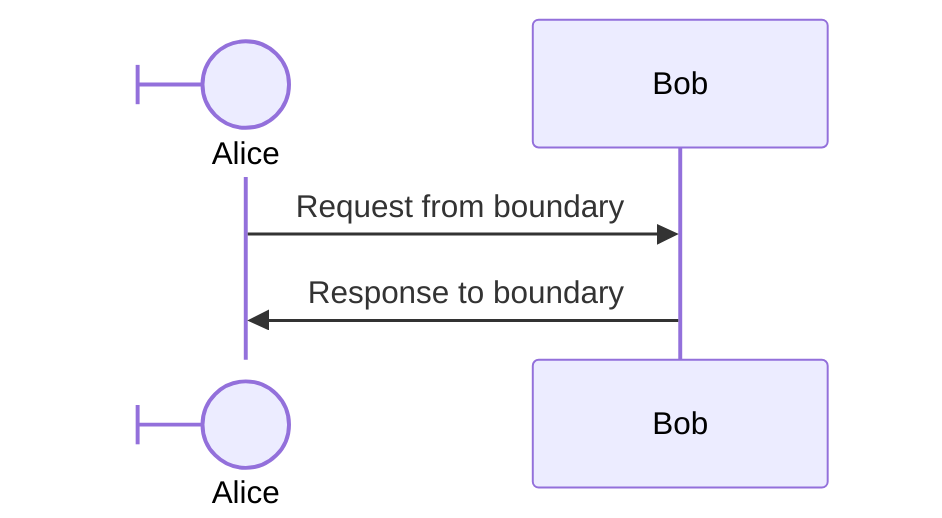

Docs: <https://mermaid.js.org/syntax/sequenceDiagram.html>

### State Diagrams

> A state diagram is a type of diagram used in computer science and related fields to describe the behavior of systems.
> State diagrams require that the system described is composed of a finite number of states; sometimes, this is indeed the case,
> while at other times this is a reasonable abstraction.

- Use `stateDiagram-v2` for state machine visualization.

Example:

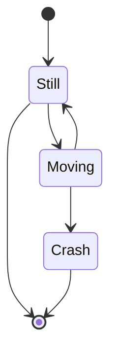

Docs: <https://mermaid.js.org/syntax/stateDiagram.html>

### User Journey Diagram

> User journeys describe at a high level of detail exactly what steps different users take to complete a specific task within a system,
> application or website. This technique shows the current (as-is) user workflow, and reveals areas of improvement for the to-be workflow.

- Use `journey` for state machine visualization.

Example:

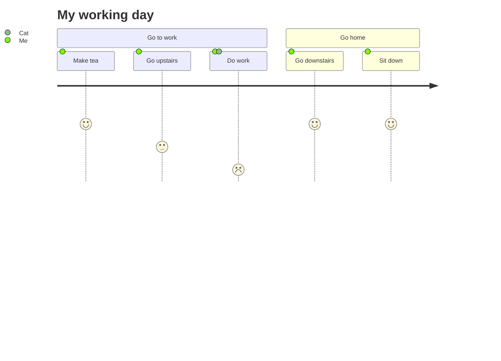

Docs: <https://mermaid.js.org/syntax/userJourney.html>

## What to Avoid

- **Over-complexity**: Avoid massive diagrams that are hard to render or read.
- **Non-standard Extensions**: Stick to core Mermaid features for maximum portability.
- **Hardcoding Styles**: Prefer class-based styling or default themes over inline styles where possible.

## Maintenance

Note that this file should be updated if Mermaid syntax changes or new useful patterns are discovered.
