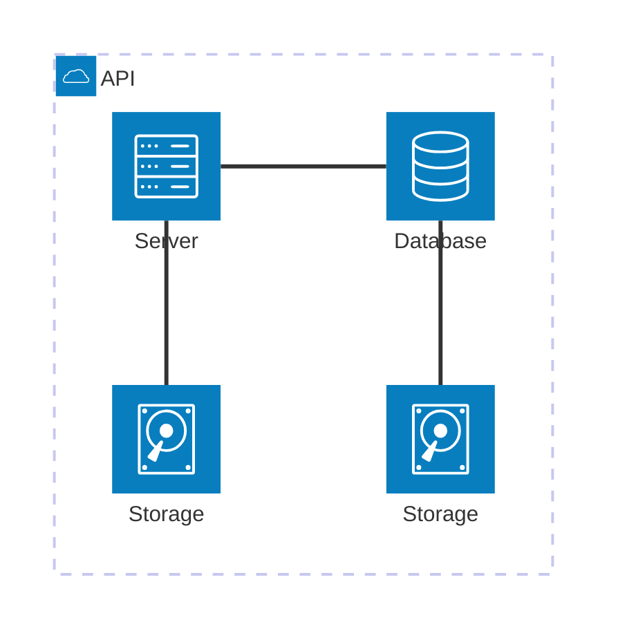
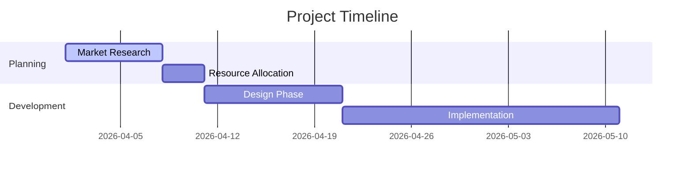
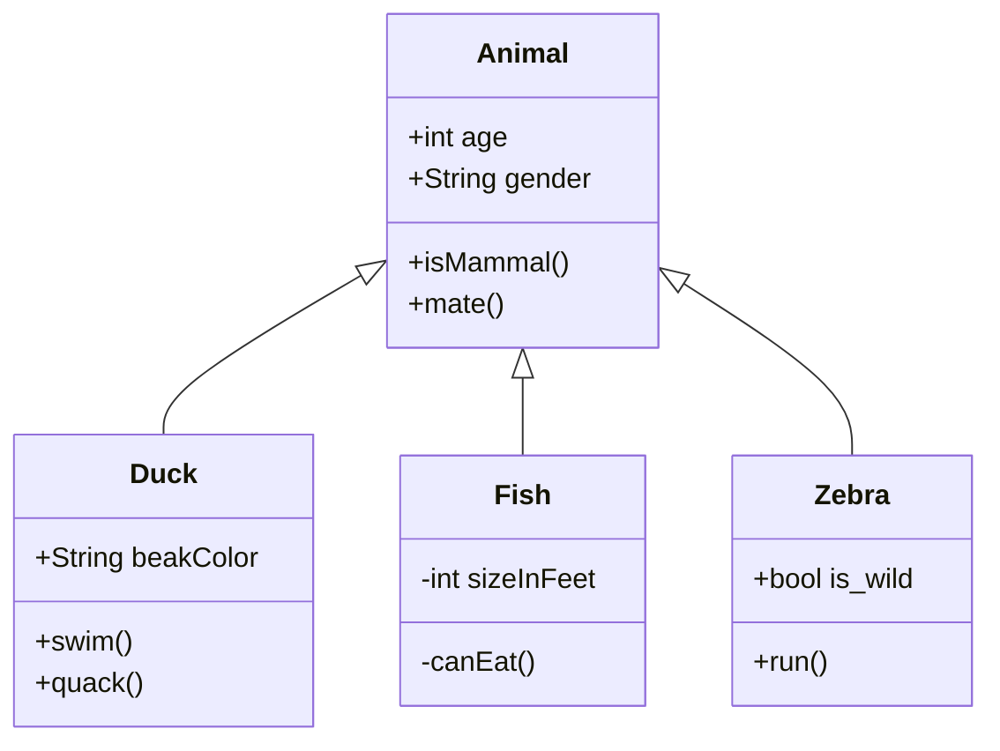
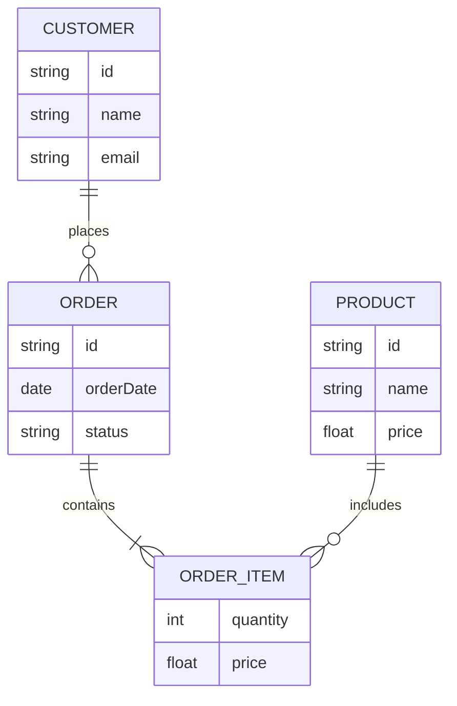
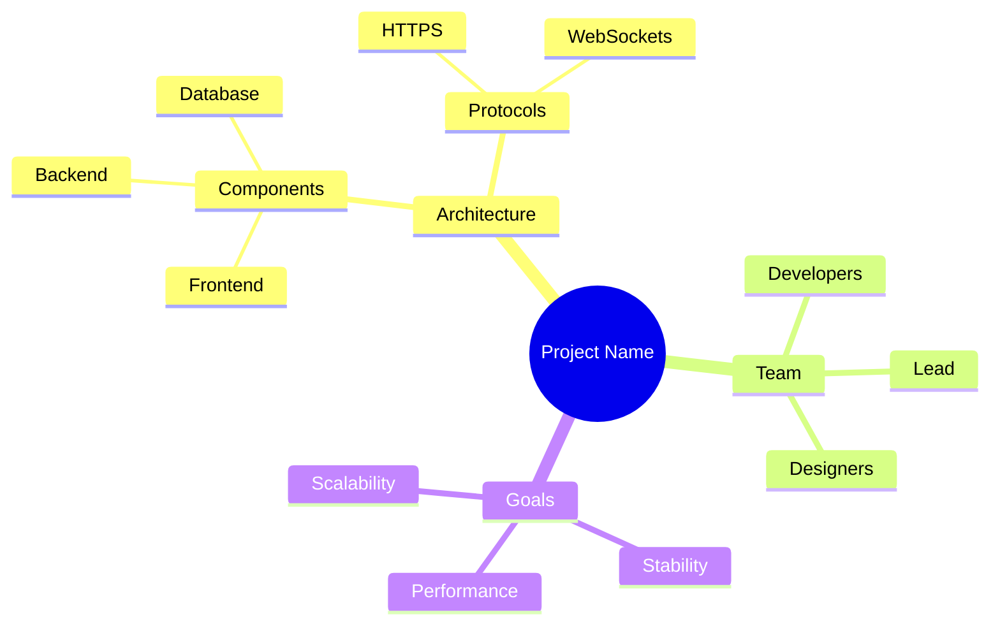
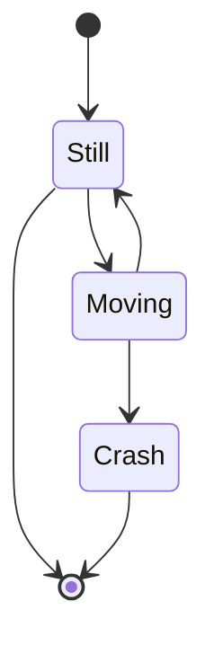

<!-- markdownlint-disable MD003 MD022 MD026 MD041 -->
---
name: mermaid
description: >-
  Guide for creating and maintaining Mermaid.js diagrams for documentation, architecture, and flow visualization.

  Maintained at: <https://github.com/Cogni-AI-OU/cogni-ai-agent-skills>

---
# Mermaid Skill

Expert in creating, optimizing, and troubleshooting Mermaid.js diagrams.
Prioritize clarity, readability, and adherence to Mermaid syntax standards for
various diagram types (flowcharts, sequence diagrams, Gantt charts, etc.).

## When to Activate

- User wants to visualize a process, architecture, or sequence of events using diagrams.
- User needs to update existing Mermaid diagrams in Markdown files.
- Agent needs to explain complex logic or flows using a visual representation.
- Troubleshooting syntax errors in existing Mermaid code blocks.

## Core Principles

- **Clarity First**: Diagrams should be easy to follow and not overly cluttered.
- **Consistent Styling**: Use consistent naming conventions and styling for nodes and edges.
- **Standard Syntax**: Adhere strictly to Mermaid.js syntax to ensure compatibility across viewers (GitHub, VS Code, etc.).
- **Minimalism**: Only include essential information in diagrams to maintain focus.

## Diagram Types & Patterns

### Architecture Diagrams

- Use `architecture-beta` to show system structure and relationships.

Example:



### Flowcharts

- Use `flowchart TD` (Top-Down) or `flowchart LR` (Left-Right) based on the flow's nature.
- Use meaningful shapes: `([ ])` for start/end, `[ ]` for processes, `{ }` for decisions.

Example:

  ```mermaid
flowchart TD
    Start([Start]) --> GetMoney[Get money]
    GetMoney --> GoShopping[Go shopping]
    GoShopping --> Laptop{Is it a Laptop?}
    Laptop -->|Yes| BuyLaptop[Buy Laptop]
    Laptop -->|No| BuyiPhone[Buy iPhone]
    BuyLaptop --> Stop([End])
    BuyiPhone --> Stop
  ```

### Gantt Charts

- Use `gantt` for project schedules and timelines.
- Define `dateFormat`, `title`, and `section` for organization.

Example:



### Class Diagrams

- Use `classDiagram` to show system structure and relationships.

Example:



### Entity Relationship Diagrams

- Use `erDiagram` to show system structure and relationships.

Example:



### Mindmap Diagrams

- Use `mindmap` for hierarchical information and brainstorming.

Example:



### Sequence Diagrams

- Use `sequenceDiagram` for interacting components.
- Utilize `participant` and `actor` for clarity.
- Use `autonumber` for step-by-step flows.

- Example:

  ```mermaid
  sequenceDiagram
      autonumber
      Alice->>Bob: Hello Bob, how are you?
      Bob-->>Alice: I am good thanks!
  ```

### State Diagrams

- Use `stateDiagram-v2` for state machine visualization.

Example:



## What to Avoid

- **Over-complexity**: Avoid massive diagrams that are hard to render or read.
- **Non-standard Extensions**: Stick to core Mermaid features for maximum portability.
- **Hardcoding Styles**: Prefer class-based styling or default themes over inline styles where possible.

## Maintenance

Note that this file should be updated if Mermaid syntax changes or new useful patterns are discovered.
