<!-- markdownlint-disable MD003 MD022 MD026 MD041 -->
---
name: mermaid
description: >-
  Guide for creating and maintaining Mermaid.js diagrams for documentation, architecture, and flow visualization.

  Maintained at: <https://github.com/Cogni-AI-OU/cogni-ai-agent-skills>

---
# Mermaid Skill

Expert in creating, optimizing, and troubleshooting Mermaid.js diagrams.
Prioritize clarity, readability, and adherence to Mermaid syntax standards for
various diagram types (flowcharts, sequence diagrams, Gantt charts, etc.).

## When to Activate

- User wants to visualize a process, architecture, or sequence of events using diagrams.
- User needs to update existing Mermaid diagrams in Markdown files.
- Agent needs to explain complex logic or flows using a visual representation.
- Troubleshooting syntax errors in existing Mermaid code blocks.

## Core Principles

- **Clarity First**: Diagrams should be easy to follow and not overly cluttered.
- **Consistent Styling**: Use consistent naming conventions and styling for nodes and edges.
- **Standard Syntax**: Adhere strictly to Mermaid.js syntax to ensure compatibility across viewers (GitHub, VS Code, etc.).
- **Minimalism**: Only include essential information in diagrams to maintain focus.

## Diagram Types & Patterns

### Architecture Diagrams

An Architecture diagram is specialized for mapping out topological structures,
infrastructure components, and their network or logical relationships.

- Use `architecture-beta` to initialize the diagram.
- Define logical groupings using `group <alias>(<icon>)[<Label>]`.
- Define individual services using `service <alias>(<icon>)[<Label>]`.
- Nest a service inside a group by appending `in <group_alias>`.
- Connect components by specifying their connection sides (`L`, `R`, `T`, `B`)
  separated by `--` (e.g., `serviceA:R -- L:serviceB`).

Example mapping out a cloud-based serverless architecture:

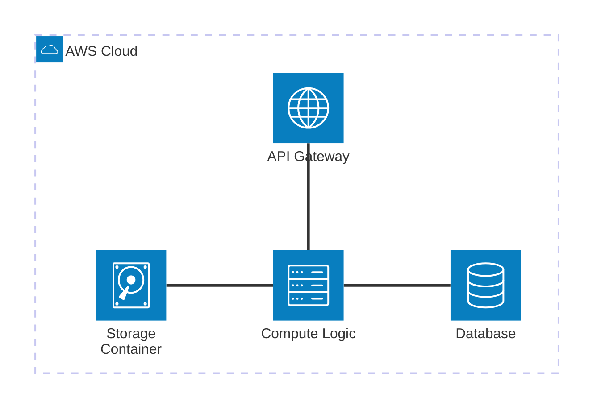
```mermaid
architecture-beta
    group aws(cloud)[AWS Cloud]

    service gateway(internet)[API Gateway] in aws
    service lambda(server)[Compute Logic] in aws
    service db(database)[Database] in aws
    service storage(disk)[Storage Container] in aws

    gateway:B -- T:lambda
    lambda:R -- L:db
    lambda:L -- R:storage
```

Docs: <https://mermaid.js.org/syntax/architecture.html>

### Block Diagrams

A Block diagram is well-suited for visualizing architectures, systems, or process
flows by arranging blocks in a customizable grid layout.

- Use `block-beta` to initialize the diagram type.
- Define grid columns using `columns <number>` (e.g., `columns 3`).
- Define blocks by using an ID, optionally with text and shape (e.g., `DB(("Database"))`).
- Group blocks within a parent block using `block:<ID>` or `block:<ID>:<width>` and close with `end`.
- Use `space` or `space:<number>` to skip grid columns.
- Connect blocks using arrows (e.g., `A --> B`) and apply styles using the `style` directive.

Example demonstrating a grid-based architecture layout:

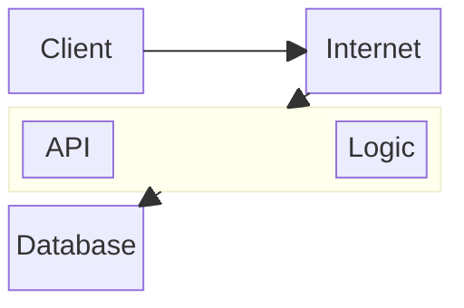
```mermaid
block-beta
columns 3
  Client
  space
  Internet

  block:Server:3
    API
    space:2
    Logic
  end

  Database

  Client --> Internet
  Internet --> Server
  Server --> Database
```

Docs: <https://mermaid.js.org/syntax/block.html>

### C4 Diagrams

The C4 model is a lean graphical notation technique for modeling the
architecture of software systems at different levels of abstraction.

- Use `C4Context`, `C4Container`, `C4Component`, or `C4Dynamic` to
  initialize the appropriate diagram level.
- Define an optional `title` to specify the diagram's purpose.
- Use entity definitions like `Person`, `System`, `System_Ext`,
  `Container`, and `Component` with the format
  `Type(alias, "Label", "Optional Description")`.
- Structure the layout using boundaries such as
  `Enterprise_Boundary(alias, "Label") { ... }`.
- Connect entities using `Rel(from, to, "Label", "Optional Tech")`.

Example demonstrating a System Context Diagram:

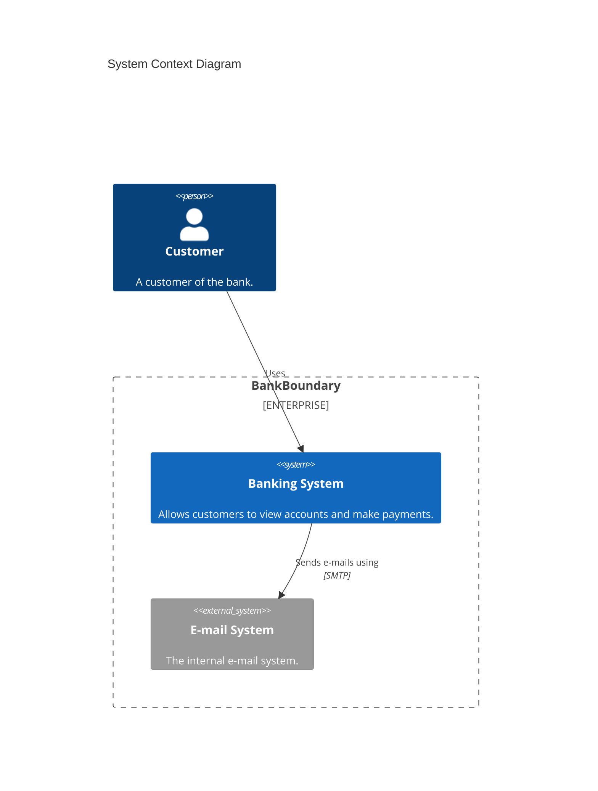
```mermaid
C4Context
    title System Context Diagram
    Person(customer, "Customer", "A customer of the bank.")
    Enterprise_Boundary(b0, "BankBoundary") {
        System(banking_system, "Banking System", "Allows customers to view accounts and make payments.")
        System_Ext(mail_system, "E-mail System", "The internal e-mail system.")
    }
    Rel(customer, banking_system, "Uses")
    Rel(banking_system, mail_system, "Sends e-mails using", "SMTP")
```

Docs: <https://mermaid.js.org/syntax/c4.html>

### Class Diagrams

A Class diagram is a static structure diagram that describes the
structure of a system by detailing its classes, attributes,
operations (or methods), and the relationships among objects.

- Use `classDiagram` to model object-oriented structures, including classes, interfaces, and their relationships.
- Define class members with visibility modifiers (`+` public, `-` private, `#` protected, `~` package/internal).
- Use relationships like inheritance (`<|--`), composition (`*--`), aggregation (`o--`), and dependency (`<..`).
- Include multiplicity (e.g., `"1"` to `"*"`) and annotations (e.g., `<<interface>>`, `<<abstract>>`) for detailed modeling.

Example with Relationships and Multiplicity:

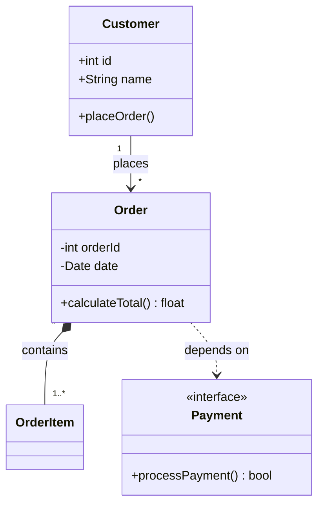
```mermaid
classDiagram
    class Customer {
        +int id
        +String name
        +placeOrder()
    }
    class Order {
        -int orderId
        -Date date
        +calculateTotal() float
    }
    class Payment {
        <<interface>>
        +processPayment() bool
    }

    Customer "1" --> "*" Order : places
    Order "*" *-- "1..*" OrderItem : contains
    Order ..> Payment : depends on
```

Example with Generic Types, Abstract Classes, and Visibility:

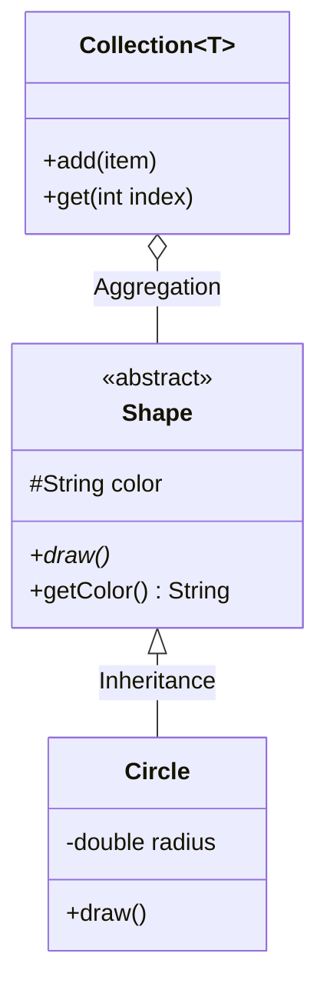
```mermaid
classDiagram
    class Shape {
        <<abstract>>
        #String color
        +draw()*
        +getColor() String
    }
    class Circle {
        -double radius
        +draw()
    }
    class Collection~T~ {
        +add(item)
        +get(int index)
    }

    Shape <|-- Circle : Inheritance
    Collection~Shape~ o-- Shape : Aggregation
```

Docs: <https://mermaid.js.org/syntax/classDiagram.html>

### Entity Relationship Diagrams

An Entity-Relationship (ER) model describes interrelated things of
interest in a specific domain of knowledge. They specify relationships
that can exist between entity types and instances.

- Use `erDiagram` to model database schemas and entity relations.
- Define relationships using cardinality markers like `||--o{`
  (one-to-zero-or-more), `}o--|{` (zero-or-more to one-or-more), etc.
- Specify entity attributes alongside their data types inside blocks (`{ ... }`).
- Indicate Primary Keys (`PK`), Foreign Keys (`FK`), and Unique constraints (`UK`).

Example with Keys and Relationships:

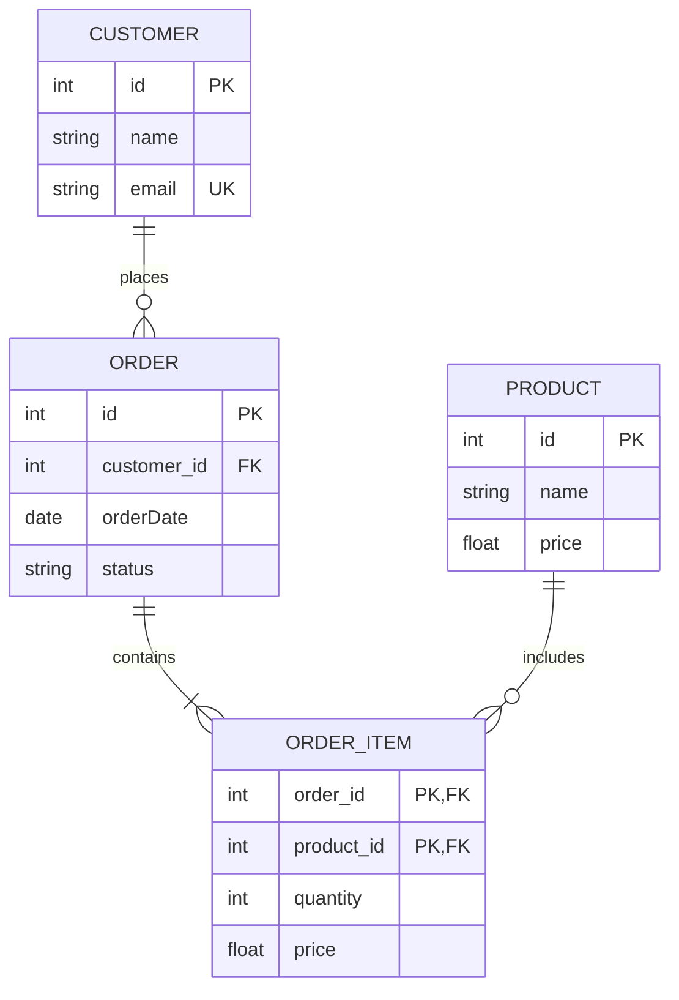
```mermaid
erDiagram
    CUSTOMER ||--o{ ORDER : places
    ORDER ||--|{ ORDER_ITEM : contains
    PRODUCT ||--o{ ORDER_ITEM : includes

    CUSTOMER {
        int id PK
        string name
        string email UK
    }
    ORDER {
        int id PK
        int customer_id FK
        date orderDate
        string status
    }
    PRODUCT {
        int id PK
        string name
        float price
    }
    ORDER_ITEM {
        int order_id PK, FK
        int product_id PK, FK
        int quantity
        float price
    }
```

Docs: <https://mermaid.js.org/syntax/entityRelationshipDiagram.html>

### Flowcharts

- Use `flowchart` to show process flows, algorithms, or any step-by-step logic.
- Specify direction (e.g., `TD` for top-down, `LR` for left-right).
- Utilize different node shapes (e.g., `[rect]`, `(rounded)`, `{diamond}`, `[(database)]`).
- Group nodes logically using `subgraph` blocks.

Example with Subgraphs and Styling:

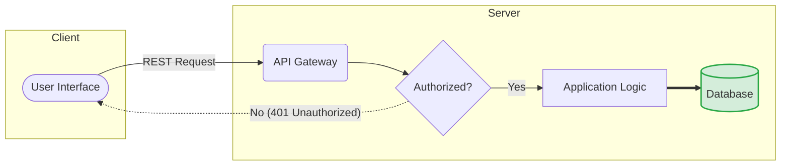
```mermaid
flowchart LR
    subgraph Client
        UI([User Interface])
    end

    subgraph Server
        API(API Gateway)
        Auth{Authorized?}
        App[Application Logic]
        DB[(Database)]
    end

    UI -- "REST Request" --> API
    API --> Auth
    Auth -- "Yes" --> App
    Auth -.->|"No (401 Unauthorized)"| UI
    App ==> DB

    classDef success fill:#d4edda,stroke:#28a745,stroke-width:2px;
    class DB success
```

Example Flowchart with New Shapes:

```mermaid
flowchart RL
    A@{ shape: manual-file, label: "File Handling"}
    B@{ shape: manual-input, label: "User Input"}
    C@{ shape: docs, label: "Multiple Documents"}
    D@{ shape: procs, label: "Process Automation"}
    E@{ shape: paper-tape, label: "Paper Records"}
```

Docs: <https://mermaid.js.org/syntax/flowchart.html>

### Gantt Charts

A Gantt chart is a type of bar chart that illustrates a project
schedule and the amount of time it takes for tasks to finish.

- Use `gantt` for creating project schedules and timelines.
- Define the `dateFormat` to specify how dates are parsed (e.g. `YYYY-MM-DD`).
- Divide tasks into categories using `section`.
- Detail tasks with names, statuses (e.g., `crit`, `done`, `active`), aliases/IDs,
  start times/dependencies (e.g., `after id`), and durations (`10d`, `24h`).
- Exclude days like `weekends` or specific dates using `excludes`.

Example with Sections and Task Dependencies:

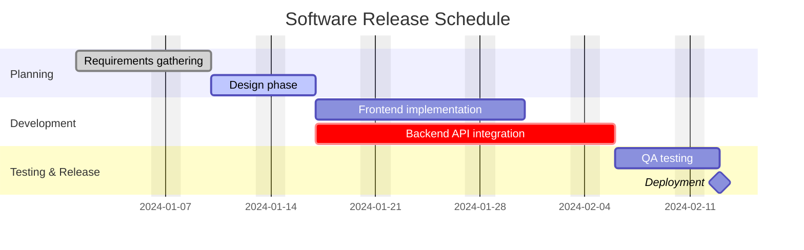
```mermaid
gantt
    title Software Release Schedule
    dateFormat  YYYY-MM-DD
    excludes    weekends

    section Planning
    Requirements gathering :done,    req1, 2024-01-01, 7d
    Design phase           :active,  des1, after req1, 5d

    section Development
    Frontend implementation:         dev1, after des1, 10d
    Backend API integration:crit,    dev2, after des1, 14d

    section Testing & Release
    QA testing             :         qa1,  after dev2, 5d
    Deployment             :milestone, m1,  after qa1, 0d
```

Docs: <https://mermaid.js.org/syntax/gantt.html>

### GitGraph Diagrams

A GitGraph diagram visualizes Git repository structures, including branches,
commit histories, and merge strategies.

- Use `gitGraph` to layout the repository history diagram.
- Add commits to the active branch using the `commit` command. Customize
  its appearance or metadata with `id`, `tag`, or `type` (e.g., `HIGHLIGHT`).
- Create branches using `branch <name>`.
- Switch between existing branches using `checkout <name>`.
- Merge a branch into the current one using `merge <branch_name>`.

Example with Branches, Commits, and Merges:

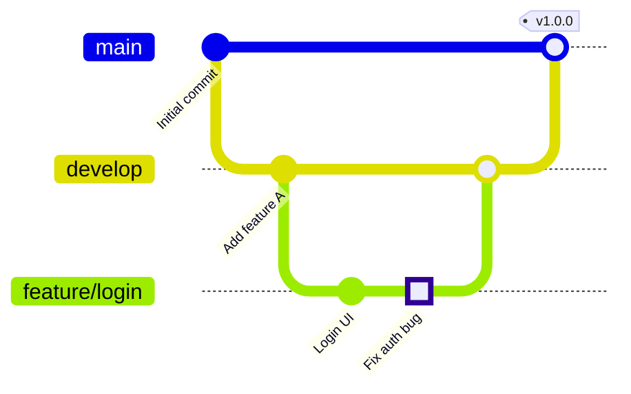
```mermaid
gitGraph
    commit id: "Initial commit"
    branch develop
    checkout develop
    commit id: "Add feature A"
    branch feature/login
    checkout feature/login
    commit id: "Login UI"
    commit type: HIGHLIGHT id: "Fix auth bug"
    checkout develop
    merge feature/login
    checkout main
    merge develop tag: "v1.0.0"
```

Docs: <https://mermaid.js.org/syntax/gitgraph.html>

### Ishikawa Diagram (v11.12.3+)

An Ishikawa diagram (also known as a fishbone or cause-and-effect diagram) is used
to represent the causes of a specific event or problem.

- Use `ishikawa-beta` to initialize the diagram type.
- The first line after the declaration represents the main event or problem (the "head").
- Subsequent lines are the major categories of causes.
- Indent lines to create nested "fishbone" sub-causes under their parent categories.

Example mapping out the causes of a website outage:

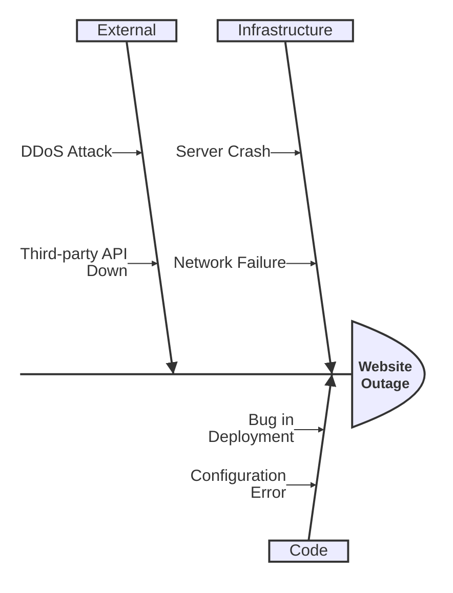
```mermaid
ishikawa-beta
    Website Outage
    Infrastructure
        Server Crash
        Network Failure
    Code
        Bug in Deployment
        Configuration Error
    External
        DDoS Attack
        Third-party API Down
```

Docs: <https://mermaid.js.org/syntax/ishikawa.html>

### Kanban Diagram

A Kanban diagram visualizes work at various stages of a process, using columns to
represent stages and cards to represent individual work items.

- Use `kanban` to initialize the diagram type.
- Define columns by writing the column name directly (e.g., `Todo`, `Done`).
- Add tasks underneath their corresponding column using square brackets (`[Task Name]`).
- Optionally add metadata like `id: <number>` or `assigned: <name>` indented under a task.

Example demonstrating a simple workflow with assignments:

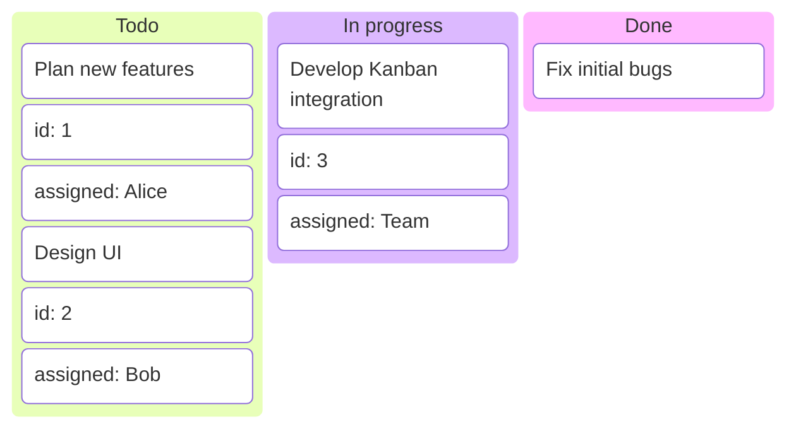
```mermaid
kanban
  Todo
    [Plan new features]
      id: 1
      assigned: Alice
    [Design UI]
      id: 2
      assigned: Bob
  In progress
    [Develop Kanban integration]
      id: 3
      assigned: Team
  Done
    [Fix initial bugs]
```

Docs: <https://mermaid.js.org/syntax/kanban.html>

### Mindmap Diagrams

A Mindmap is a diagram used to visually organize information into a hierarchy,
showing relationships and sub-components radiating from a central concept.

- Use `mindmap` to create hierarchical diagrams such as facts stores or brainstorms.
- Establish relationships and hierarchy strictly through indentation.
- Define a central starting node (e.g., `root((Project Name))`).
- Customize node shapes using brackets like `[square]`, `(rounded)`,
  `((circle))`, or `{{hexagon}}`.

Example representing a canonical facts store:

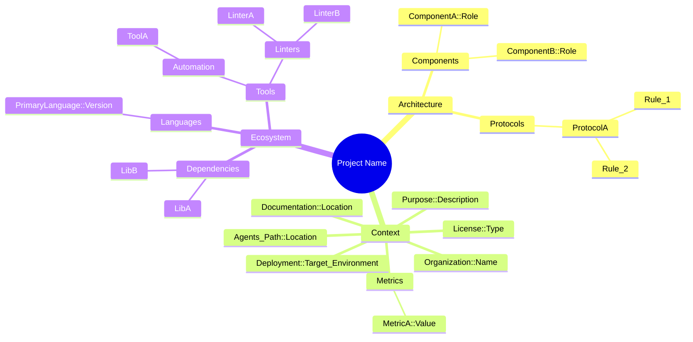
```mermaid
%% Example canonical facts store
%% Note: Keep items in alphabetical order.
mindmap
  root((Project Name))
    Architecture
      Components
        ComponentA::Role
        ComponentB::Role
      Protocols
        ProtocolA
          Rule_1
          Rule_2
    Context
      Agents_Path::Location
      Deployment::Target_Environment
      Documentation::Location
      License::Type
      Metrics
        MetricA::Value
      Organization::Name
      Purpose::Description
    Ecosystem
      Dependencies
        LibA
        LibB
      Languages
        PrimaryLanguage::Version
      Tools
        Automation
          ToolA
        Linters
          LinterA
          LinterB
```

Docs: <https://mermaid.js.org/syntax/mindmap.html>

### Packet Diagram

A Packet diagram is typically used to visualize network protocols or binary data
structures, showing the bits and bytes that make up headers or payloads.

- Use `packet-beta` to initialize the diagram type.
- Add an optional `title` to describe the structure.
- Define bits mapping using ranges representing bit boundaries (e.g., `0-7`).
- Add descriptive labels for each bit range (e.g., `0-7: "Field Name"`).
- The diagram automatically wraps fields into 32-bit rows by default.

Example using a binary block, such as the PNG magic signature file header:

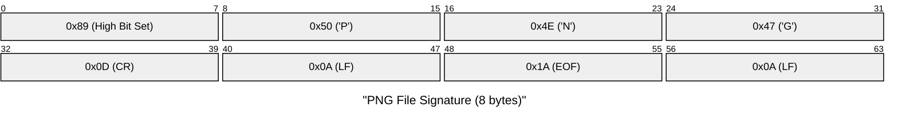
```mermaid
packet-beta
    title "PNG File Signature (8 bytes)"
    0-7: "0x89 (High Bit Set)"
    8-15: "0x50 ('P')"
    16-23: "0x4E ('N')"
    24-31: "0x47 ('G')"
    32-39: "0x0D (CR)"
    40-47: "0x0A (LF)"
    48-55: "0x1A (EOF)"
    56-63: "0x0A (LF)"
```

Docs: <https://mermaid.js.org/syntax/packet.html>

### Pie chart diagrams

A Pie chart is a circular statistical graphic divided into slices to
illustrate numerical proportions.

- Use `pie` to visualize parts of a whole and percentages.
- Append `showData` after the declaration (e.g., `pie showData`) to display the
  actual data values in the legend alongside their percentages.
- Define an optional `title` to describe the chart.
- Specify data slices using the format `"label" : value`.

Example with data values shown:

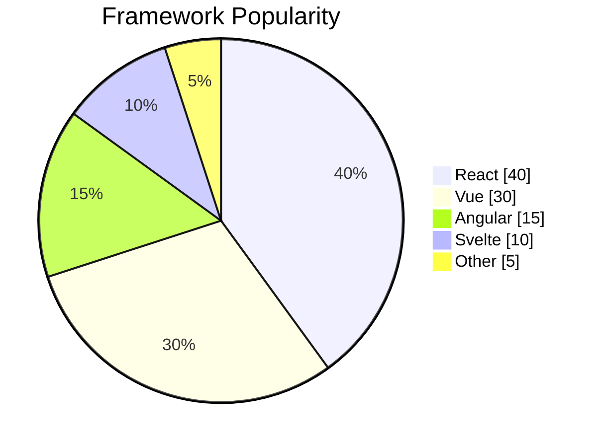
```mermaid
pie showData
    title Framework Popularity
    "React" : 40
    "Vue" : 30
    "Angular" : 15
    "Svelte" : 10
    "Other" : 5
```

Docs: <https://mermaid.js.org/syntax/pie.html>

### Quadrant Chart

A Quadrant chart visualizes items across a two-dimensional grid
divided into four quadrants. It is often used to evaluate or prioritize
data based on two criteria (e.g., effort versus impact).

- Use `quadrantChart` to evaluate and position items in four quadrants.
- Add an optional `title` to describe the matrix.
- Define axes using `x-axis <left> --> <right>` and `y-axis <bottom> --> <top>`.
- Assign labels to quadrants using `quadrant-1` (top right), `quadrant-2`
  (top left), `quadrant-3` (bottom left), and `quadrant-4` (bottom right).
- Place items using `"Label": [x, y]` coordinates (values between `0.0` and `1.0`).

Example with Axes, Quadrant Labels, and Points:

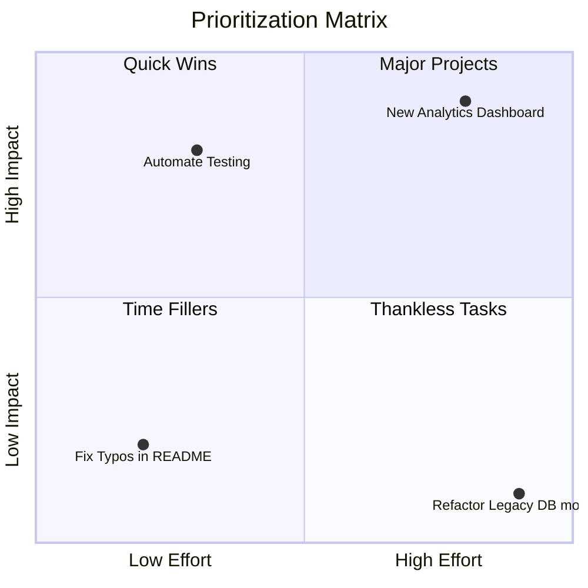
```mermaid
quadrantChart
    title Prioritization Matrix
    x-axis Low Effort --> High Effort
    y-axis Low Impact --> High Impact
    quadrant-1 Major Projects
    quadrant-2 Quick Wins
    quadrant-3 Time Fillers
    quadrant-4 Thankless Tasks
    "Automate Testing": [0.3, 0.8]
    "New Analytics Dashboard": [0.8, 0.9]
    "Fix Typos in README": [0.2, 0.2]
    "Refactor Legacy DB module": [0.9, 0.1]
```

Docs: <https://mermaid.js.org/syntax/quadrantChart.html>

### Radar Diagram (v11.6.0+)

A Radar diagram (or spider chart) is a graphical method of displaying multivariate data
in the form of a two-dimensional chart of three or more quantitative variables represented
on axes starting from the same central point.

- Use `radar-beta` to initialize the diagram.
- Include an optional `title` to identify what the radar chart represents.
- Specify the variable categories along the perimeter using `axis` and a comma-separated list.
- Provide the numeric datasets for each entity using `curve <label> {values}`.

Example representing a team skill assessment:

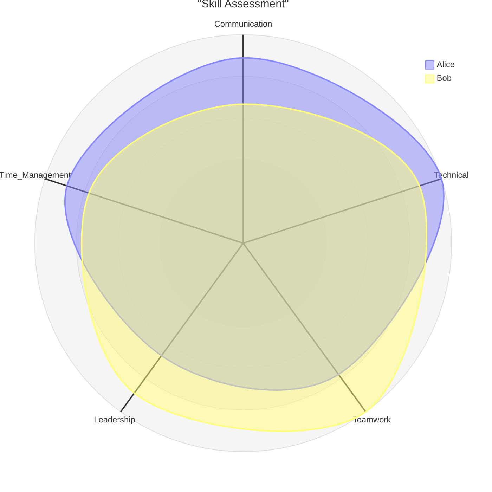
```mermaid
radar-beta
    title "Skill Assessment"
    axis Communication, Technical, Teamwork, Leadership, Time_Management
    curve Alice {8, 9, 7, 6, 8}
    curve Bob {6, 8, 9, 8, 7}
```

Docs: <https://mermaid.js.org/syntax/radar.html>

### Requirement Diagram

A Requirement diagram provides a visualization for requirements,
components, and the connections mapping dependencies between them.

- Use `requirementDiagram` to model requirements and system element dependencies.
- Define a `requirement` block with attributes like `id` (numeric), `text`,
  `risk` (Low, Medium, High), and `verifymethod` (Analysis, Demonstration, Inspection, Test).
- Define `element` blocks to represent system components that relate to requirements.
- Use relationships to link elements and requirements applying the format
  `- <type> ->` (e.g., `satisfies`, `contains`, `derives`, `refines`).

Example with Requirements, Elements, and Relationships:

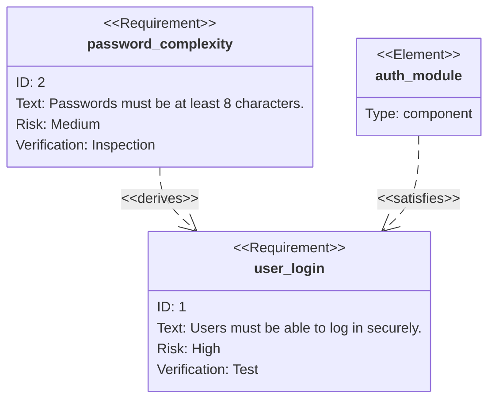
```mermaid
requirementDiagram

    requirement user_login {
    id: 1
    text: Users must be able to log in securely.
    risk: high
    verifymethod: test
    }

    requirement password_complexity {
    id: 2
    text: Passwords must be at least 8 characters.
    risk: medium
    verifymethod: inspection
    }

    element auth_module {
    type: component
    }

    password_complexity - derives -> user_login
    auth_module - satisfies -> user_login
```

Docs: <https://mermaid.js.org/syntax/requirementDiagram.html>

### Sankey Diagram

A Sankey diagram is a flow diagram in which the width of the bands is proportional
to the flow rate. It is typically used to visualize energy, material, or cost
transfers between processes.

- Use `sankey-beta` to initialize the diagram.
- Define flows using comma-separated values in the format `source, target, value`.
- The `value` specifies the thickness of the connection between nodes.
- Define nodes via their usage; no prior declaration is needed.

Example visualizing energy flows:

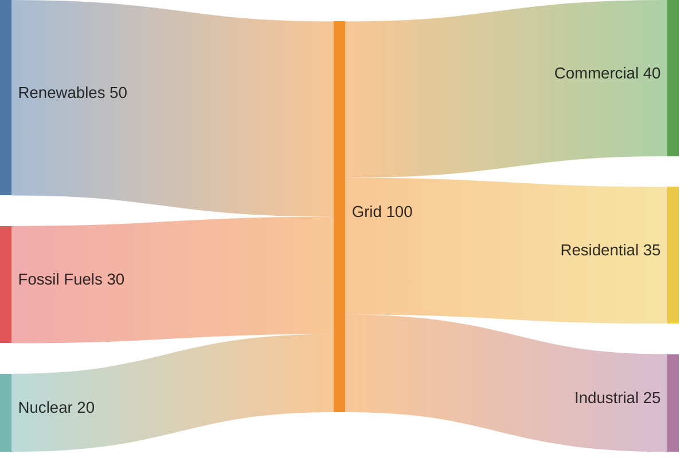
```mermaid
sankey-beta
    Renewables, Grid, 50
    Fossil Fuels, Grid, 30
    Nuclear, Grid, 20
    Grid, Commercial, 40
    Grid, Residential, 35
    Grid, Industrial, 25
```

Docs: <https://mermaid.js.org/syntax/sankey.html>

### Sequence Diagrams

A Sequence diagram is an interaction diagram that shows how processes operate with one another and in what order.

- Use `sequenceDiagram` for interacting components.
- Define explicitly with `participant` or `actor`, and use aliases (`actor U as User`) for concise code.
- Use `autonumber` for automatic step numbering.
- Indicate execution context with activations (`+` / `-` or `activate`/`deactivate`).
- Add logic blocks (`alt` / `else`, `opt`, `loop`).
- Group participants using `box` blocks to denote system boundaries.

Example with Actors, Grouping, Logic, and Activations:

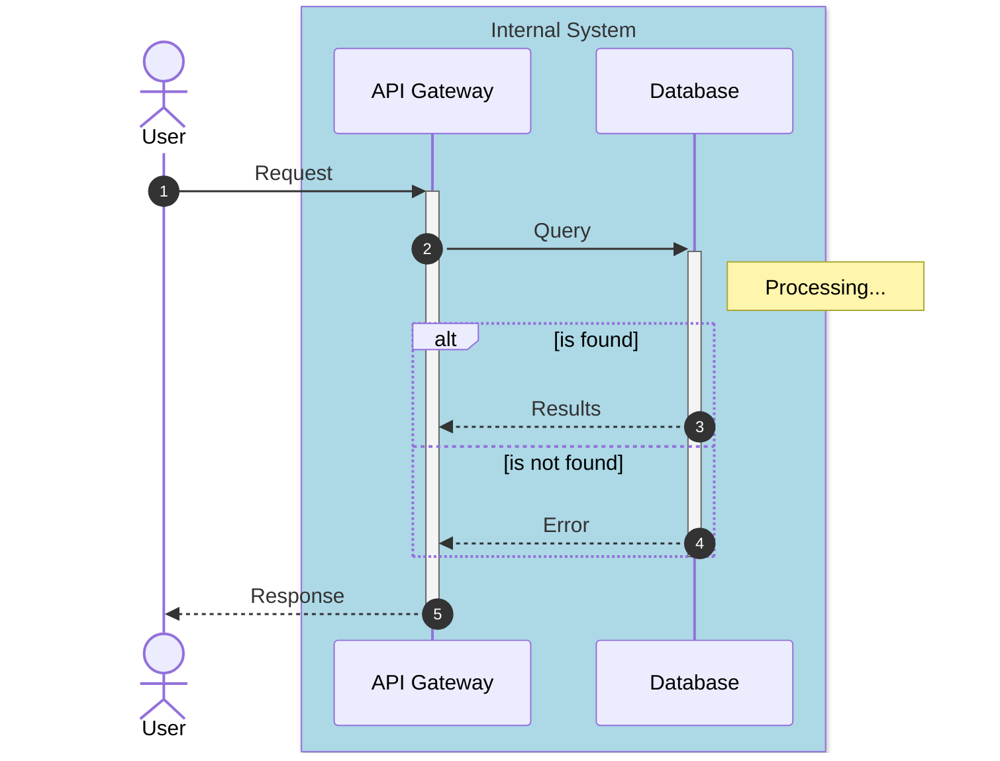
```mermaid
sequenceDiagram
    autonumber
    actor U as User
    box LightBlue Internal System
        participant A as API Gateway
        participant S as Database
    end

    U->>+A: Request
    A->>+S: Query
    Note right of S: Processing...

    alt is found
        S-->>A: Results
    else is not found
        S-->>A: Error
    end

    deactivate S
    A-->>-U: Response
```

Example with Special Participant Types:

```mermaid
sequenceDiagram
    participant C as Boundary@{ "type" : "boundary" }
    participant S as Service
    C->>S: Request from boundary
    S->>C: Response to boundary
```

Docs: <https://mermaid.js.org/syntax/sequenceDiagram.html>

### State Diagrams

A State diagram describes the behavior of a system by representing
it as a finite number of states and the transitions between them.

- Use `stateDiagram-v2` for state machine visualization.
- Define states and use `-->` for transitions.
- Use `[*]` to represent the initial and final states.
- Describe transitions (e.g., `State1 --> State2 : Transition text`).
- Group related states logically using composite states.

Example with Transitions and Composite States:

```mermaid
stateDiagram-v2
    [*] --> Idle

    Idle --> Processing : Start

    state Processing {
        [*] --> Validating
        Validating --> Saving : Valid
        Validating --> ErrorMode : Invalid
        Saving --> [*]
    }

    Processing --> Idle : Complete
    Processing --> ErrorMode : Failed
    ErrorMode --> Idle : Reset
    ErrorMode --> [*] : Fatal
```

Docs: <https://mermaid.js.org/syntax/stateDiagram.html>

### Timeline Diagram

A Timeline diagram is a graphical representation used to display
a list of events in chronological order.

- Use `timeline` to visualize chronological events and historical progress.
- Include an optional `title` to describe the timeline's subject.
- Group events logically using `section` blocks.
- Define periods and associated events using the format
  `<time period> : <event> : <additional event>`.

Example with Sections and Multiple Events:

```mermaid
timeline
    title History of Social Media
    section 2000s
        2002 : LinkedIn
        2004 : Facebook
        2006 : Twitter
    section 2010s
        2010 : Instagram : Pinterest
        2016 : TikTok
```

Docs: <https://mermaid.js.org/syntax/timeline.html>

### Treemap Diagram

A Treemap diagram represents hierarchical data as a set of nested rectangles, where
the area of each rectangle is proportional to its value.

- Use `treemap-beta` to initialize the diagram type.
- Define hierarchical structures using consistent indentation. Ensure string labels are enclosed in double quotes.
- Specify values for leaf nodes by appending a colon and a number after the label (`"label": <value>`).
- The diagram will automatically calculate the size of parent nodes based on their children.

Example representing a company's budget breakdown:

```mermaid
treemap-beta
  "Marketing"
    "Social Media": 20000
    "Email Campaigns": 5000
  "R&D"
    "New Features": 40000
    "Maintenance": 15000
  "Operations"
    "Software Licenses": 10000
    "Hardware": 5000
```

Docs: <https://mermaid.js.org/syntax/treemap.html>

### TreeView Diagram (v11.14.0+)

A TreeView diagram is used to represent hierarchical data in the form of a directory-like structure.

- Use `treeView-beta` to initialize the diagram type.
- Define items as strings enclosed in double quotes (e.g., `"folder name"`).
- Establish hierarchy and parent-child relationships purely through line indentation.

Example mapping out a project directory structure:

```mermaid
treeView-beta
    "src"
        "components"
            "Header.tsx"
            "Footer.tsx"
        "utils"
            "helpers.ts"
    "tests"
        "unit"
    "package.json"
    "README.md"
```

Docs: <https://mermaid.js.org/syntax/treeView.html>

### User Journey Diagram

A User Journey describes at a high level of detail the exact steps
different users take to complete a specific task within a system,
application, or website.

- Use `journey` to visualize user experiences and workflows.
- Define a `title` for the overall journey.
- Divide the journey into logical stages using `section`.
- Define steps using the syntax `Task name: <score 1-7>: <Actor1>, <Actor2>`.
  The score indicates user satisfaction at that step.

Example with Sections, Scores, and Actors:

```mermaid
journey
    title Online Shopping Experience

    section Browsing
      Search for product: 5: Customer
      View product details: 4: Customer
      Read reviews: 3: Customer

    section Checkout
      Add to cart: 6: Customer
      Enter shipping info: 4: Customer
      Process payment: 5: Customer, System

    section Post-Purchase
      Receive confirmation: 6: Customer, System
      Track shipping: 5: Customer
```

Docs: <https://mermaid.js.org/syntax/userJourney.html>

### Venn Diagrams (v11.12.3+)

Venn diagrams visually represent the relationships between sets using overlapping circles.

- Use `venn-beta` to initialize the diagram type.
- Define a single set using the `set` keyword (e.g., `set Frontend`).
- Define the overlap of two or more sets using `union` (e.g., `union Frontend,Backend`).
- Custom display labels can be assigned using bracket syntax (e.g., `set Dev["Developers"]`).
- Specify sizes for sets or unions by appending a suffix `:N` (e.g., `set Dev:20`).
- Place additional labels inside a set or union using the `text` keyword on an indented line.

Example representing overlapping capabilities:

```mermaid
venn-beta
    title "DevOps Culture"
    set Dev["Development"]:10
    set Ops["Operations"]:10
    set QA["Quality Assurance"]:8

    union Dev,Ops["Continuous Delivery"]:4
    union Dev,QA["Test Automation"]:3
    union Ops,QA["Environments"]:3
    union Dev,Ops,QA["Cross-Functional"]:2
```

Docs: <https://mermaid.js.org/syntax/venn.html>

### XY Chart

An XY chart is an essential data visualization tool that lets you depict data points
on Cartesian coordinates. It supports visualizing data using line charts and bar charts.

- Use `xychart-beta` to initialize the diagram.
- Define an optional `title` to describe the chart.
- Specify the `x-axis` with specific categories (e.g., `[Jan, Feb]`) or a range.
- Specify the `y-axis` with an optional title and range (e.g., `"Revenue" 0 --> 100`).
- Add data series by using `bar` or `line` followed by an array of values (`[10, 20]`).

Example illustrating monthly sales and targets:

```mermaid
xychart-beta
    title "Monthly Sales and Targets"
    x-axis [Jan, Feb, Mar, Apr, May, Jun]
    y-axis "Revenue (in $)" 0 --> 10000
    bar [5000, 6000, 7500, 8200, 9500, 8800]
    line [4000, 5000, 7000, 8000, 9000, 8500]
```

Docs: <https://mermaid.js.org/syntax/xyChart.html>

### ZenUML

ZenUML is an extension that allows you to write sequence diagrams
using a declarative pseudo-code syntax, focusing on speed and readability.

- Use `zenuml` to initialize the diagram type.
- Add an optional `title` to label the diagram.
- Use `A->B: message` or `A->B: method() { ... }` for synchronous or asynchronous messages.
- Utilize programming constructs like `if (condition)`, `else`, `for`, `while`,
  and `try/catch` to build complex flow logic naturally.
- Use `return` statements to denote explicit responses.

Example of a ZenUML Sequence Diagram:

```mermaid
zenuml
    title Authentication Flow
    Client->Server: authenticate(credentials) {
        if (isValid) {
            Server->Database: fetchUser()
            return token
        } else {
            return error
        }
    }
```

Docs: <https://mermaid.js.org/syntax/zenuml.html>

## What to Avoid

- **Assuming Beta Syntax**: Avoid guessing syntax rules for `-beta` chart types. Always consult the
  latest official Mermaid documentation, as beta syntaxes can evolve.
- **Hardcoding Styles**: Prefer class-based styling or default themes over inline styles where possible.
- **Inconsistent Indentation**: Avoid mixing tabs and spaces. Using strict, consistent indentation is
  critical for hierarchy-based diagrams like Mindmaps, TreeViews, and Treemaps.
- **Non-standard Extensions**: Stick to core Mermaid features for maximum portability.
- **Over-complexity**: Avoid massive diagrams that are hard to render or read.
- **Unquoted Strings**: Avoid leaving strings that contain spaces or special characters unquoted to prevent parser breaks.

## Maintenance

Note that this file should be updated if Mermaid syntax changes or new useful patterns are discovered.
