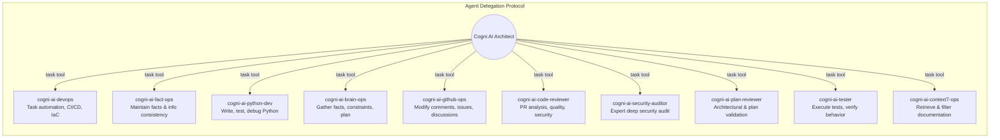
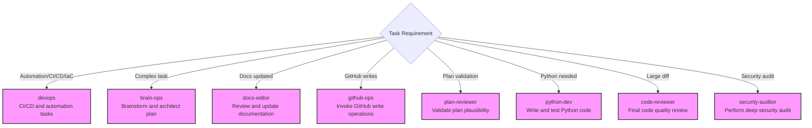

# subagent-task

<!-- markdownlint-disable MD013 MD023 MD031 MD032 -->

## When to Use

- Breaking down a complex, multi-step task into independent parallel sub-tasks (e.g., fact-gathering, log analysis, and plan validation).
- Leveraging specialized agent personas (e.g., security auditor, Python developer, code reviewer) for domain-specific work.
- Preventing context-window overload by delegating large file analysis or broad codebase searches to sub-agents.
- Running multiple independent research or analysis tasks concurrently to reduce overall execution time.

## When Not to Use

- Simple, single-step tasks that can be completed directly without delegation overhead.
- Tasks requiring tight coordination or shared state between sub-steps—the sub-agent model handles isolation better than collaboration.
- When the task scope is too small to justify the latency overhead of spawning and synthesizing sub-agent results.
- Tasks that involve modifying shared files or state that could cause conflicts between concurrent sub-agents.

## Gotchas

- Sub-agents start with a completely fresh context—they have no memory of the current conversation or prior decisions unless explicitly included in the prompt.
- The primary agent must synthesize all sub-agent results; if sub-agents return conflicting information, the primary agent needs logic to reconcile.
- Spawning too many sub-agents in parallel can hit rate limits or resource caps in the runtime environment; batch strategically.
- Not all runtime environments support all agent types—always verify available subagent types dynamically rather than hardcoding assumptions.

Provides policies and examples for using the \`task\` tool to spawn sub-agents for specialized, parallel, or complex tasks.

## Core Principles

- **Specialization**: Delegate tasks to specialized project agents rather than attempting to handle broad contexts monolithically.
- **Parallelization**: Spawn multiple agents concurrently for independent sub-tasks (e.g., retrieving facts, analyzing logs, validating plans).
- **Context Encapsulation**: Spawning sub-agents prevents the primary agent's context from becoming cluttered. Synthesize results from sub-agents into the final response.

## SUBAGENT DELEGATION POLICY

The use of the `task` tool and spawning sub-agents is permitted for complex, multi-step tasks, but delegation is limited to the project agents explicitly configured by this runtime.

- **Allowed Delegation Targets**: Use only the named project agents exposed by this runtime configuration.
- **Built-in Subagents Disabled**: Built-in `explore` and `general` subagents are not approved for this runtime and MUST NOT be used, even if a host tool still lists them.
- **Maintain Context**: Ensure that the primary agent remains the coordinator and synthesizes the results from sub-agents into the final response.
- **Strategic Delegation**: Delegate only when the task involves broad codebase analysis or independent sub-tasks that can be executed in parallel.

## Example: Agent Delegation Protocol

## Example: Delegation Scenarios

## Usage Patterns

- Always pass a clear `description` and a detailed `prompt` to the sub-agent.
- Provide the `subagent_type` argument to match the desired role. Ensure you check your available tools dynamically to find the currently supported list of project-specific agents rather than relying on a hardcoded list, as this functionality exists and is strongly recommended to be utilized for more specialized agents for relevant context.
- Ensure the primary agent acts as a coordinator, processing the `task_result` from each sub-agent before continuing the plan.
- If a sub-agent misbehaves (e.g., returning an unexpected reply) or fails to meet expectations, report this issue to the user with a clear explanation.

## Related Skills

- **critical-thinking**:
  You MUST load this skill when deconstructing complex tasks for sub-agent delegation.
- **gh**:
  You MUST load this skill when working with the `gh` command and its subcommands.
